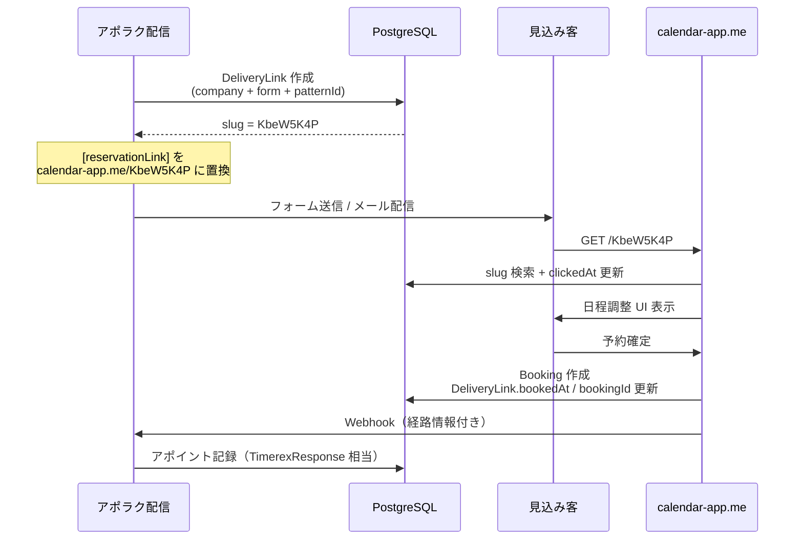
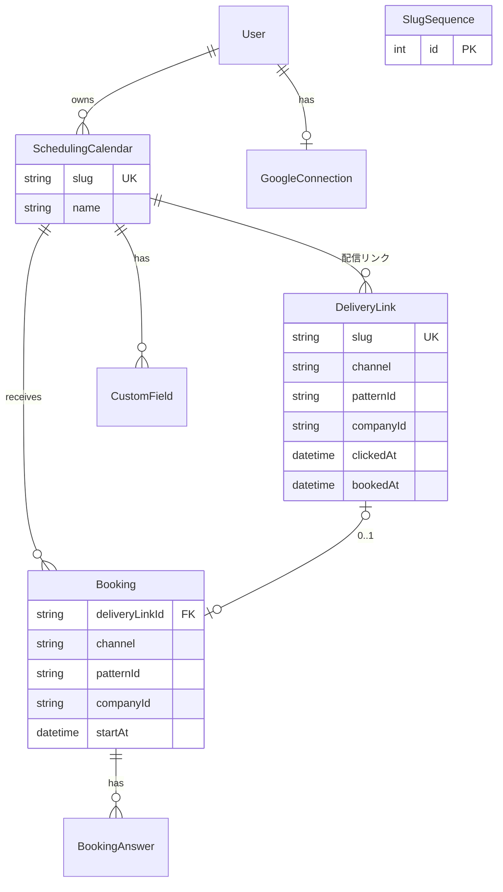

# 日程調整ツール 設計書

> 最終更新: 2026-07-04 (JST)
> ステータス: Phase 1 実装中 / 配信リンク設計確定

## 1. 概要

### 1.1 目的

[TimeRex](https://timerex.net/) の代替として、自社運用の日程調整 SaaS を構築する。
アポラク（approach-robo2）から独立した **別リポジトリ・別ドメイン** の Web アプリとして開発する。

**本番ドメイン:** `calendar-app.me`

### 1.2 解決したい課題

| 課題 | 自社ツールでの解決 |
|------|-------------------|
| TimeRex プレミアム必須の URL パラメータ（`tid` 等） | **配信リンク slug** で代替（クエリ不要） |
| `timerex.me/r/...` → TimeRex へのリダイレクト | **着地 = 日程調整**（リダイレクト不要） |
| 外部 SaaS への依存・コスト | 自社インフラで運用 |
| 数百万件配信でのリンク一意性 | Sqids + SERIAL（アポラク実績あり） |

### 1.3 スコープ外（後続 or 将来）

- Microsoft Teams 連携
- Outlook カレンダー連携
- チーム・複数メンバー日程調整（TimeRex の「全員参加」「誰か1人」等）
- リマインドメール / ウィジェット埋め込み / GA 連携

---

## 2. TimeRex 機能対応表

| TimeRex 機能 | 対応 | フェーズ |
|-------------|------|---------|
| 日程調整カレンダー作成 | ✅ | Phase 1 |
| Google カレンダー連携 | ✅ Google のみ | Phase 1 |
| 公開予約ページ | ✅ `/{slug}` | Phase 1 |
| 日程候補の自動リストアップ | ✅ | Phase 1 |
| **配信経路トラッキング**（企業・経由・文面） | ✅ **配信リンク** | Phase 4 |
| 予約確定時のメール通知 | ✅ | Phase 2 |
| キャンセル・リスケ | ✅ | Phase 2 |
| 設問項目カスタマイズ | ✅ | Phase 2 |
| Zoom / Google Meet 連携 | ✅ | Phase 2 |
| Webhook | ✅ TimeRex 互換を目指す | Phase 3 |

---

## 3. システム構成

```
┌──────────────────────────────────────────────────────────────────┐
│  日程調整ツール (calendar-app.me)                                  │
├──────────────────────────────────────────────────────────────────┤
│  管理画面              │  公開予約ページ                           │
│  /dashboard            │  /{slug}  … カレンダー or 配信リンク      │
│  /calendars            │                                          │
│  /settings             │                                          │
├──────────────────────────────────────────────────────────────────┤
│  API: /api/auth/*  /api/calendars/*  /api/public/*  /api/links/* │
├──────────────────────────────────────────────────────────────────┤
│  PostgreSQL (Prisma)                                              │
│    SchedulingCalendar / DeliveryLink / Booking / SlugSequence   │
└──────────────────────────────────────────────────────────────────┘
         │                              ▲
         │ Webhook (Phase 3)            │ 配信リンク発行 API (Phase 4)
         ▼                              │
┌──────────────────────────────────────────────────────────────────┐
│  アポラク (approach-robo2)                                          │
│  配信時: [reservationLink] → calendar-app.me/{slug} に置換         │
│  予約受信: Webhook → TimerexResponse 相当に保存                     │
└──────────────────────────────────────────────────────────────────┘
```

### 3.1 技術スタック

| レイヤ | 選定 |
|--------|------|
| フレームワーク | Next.js 15 (App Router) + TypeScript |
| DB | PostgreSQL + Prisma |
| 認証 | Auth.js（Google OAuth + Calendar スコープ） |
| slug 生成 | Sqids + SERIAL（アポラク `TrackingIdSequence` と同方式） |
| UI | Tailwind CSS |
| デプロイ | Vercel（想定） |

---

## 4. URL 設計

### 4.1 基本方針

- **Google 予約ページ風:** `https://calendar.app.google/FW4awsNdUMWJ2xvn7`
- **自社:** `https://calendar-app.me/{slug}` — **slug のみ、クエリパラメータなし**
- パスに `form` / `email` / 企業名等を埋め込まない。**不透明 ID + DB 逆引き**（[docs-view.co](https://docs-view.co/KbeW5K4P) と同じ）

### 4.2 2 種類の slug（同一 URL 空間）

| 種類 | 例 | 発行タイミング | トラッキング |
|------|-----|--------------|-------------|
| **カレンダー slug** | `calendar-app.me/FW4awsNdUMWJ2xvn7` | カレンダー作成時 | なし（直接共有用） |
| **配信リンク slug** | `calendar-app.me/KbeW5K4P` | **配信1件ごと** | 企業・経由・文面を記録 |

どちらも `GET /{slug}` で同じ予約 UI を表示する。ルートハンドラで slug の種別を判定する。

```
GET  /{slug}                         … 予約ページ（カレンダー or 配信リンク）
GET  /api/public/calendars/{slug}    … 空き枠 API（slug 種別を内部解決）
POST /api/public/bookings            … 予約確定（slug を body に含める）

# 管理画面
GET  /dashboard  /calendars  /settings/integrations  /login  /signup
```

### 4.3 slug 衝突防止

カレンダー slug・配信リンク slug は **同一の ID 生成器** を使い、全体で一意とする。

```
SlugSequence (SERIAL) → Sqids.encode([id]) → slug
```

- **衝突ゼロ:** DB の auto-increment 一意性
- **推測困難:** `SQIDS_ALPHABET` 環境変数でシャッフル（アポラクと共通化可能）
- **最小長:** 8 文字以上（数百万〜数億件規模に対応）
- **予約語除外:** `login`, `dashboard`, `calendars` 等の管理パスと衝突しないよう除外リスト

### 4.4 TimeRex / 旧アポラクフローとの比較

| | TimeRex 時代 | 自社ツール |
|--|-------------|-----------|
| 配信 URL | `timerex.me/r/{trackingId}` | `calendar-app.me/{slug}` |
| 着地 | TimeRex にリダイレクト | **そのまま日程調整** |
| 経路復元 | `?tid=` + Webhook `url_params`（プレミアム） | **slug → DeliveryLink 逆引き** |
| ドメイン数 | timerex.me + timerex.net | **calendar-app.me のみ** |

---

## 5. 配信リンク設計（Phase 4）

アポラクの `TrackingLink`（`timerex.me/r/...`）を置き換える中核機能。

### 5.1 コンセプト

**配信1件 = slug 1つ = DeliveryLink 1行**

企業 A にフォーム経由・文面 X で送るたびに新しい slug を発行する。
同じ企業にメール経由・文面 Y で送れば、別 slug になる。

→ 企業・経由（form/email/call）・文面（patternId）・件名（outreachSubjectId）は **すべて DB に保存** され、URL を読んでも判別する必要はない（slug をキーに JOIN する）。

### 5.2 フロー



### 5.3 DeliveryLink モデル

```prisma
model DeliveryLink {
  id                 String    @id @default(cuid())
  slug               String    @unique          // URL に使う ID（例: KbeW5K4P）
  calendarId         String                     // 着地カレンダー
  aporakuUserId      String                     // アポラク側 User.id（Webhook 送り先特定用）

  // --- 配信時に書き込む経路情報 ---
  channel            String                     // "form" | "email" | "call"
  patternId          String?                    // 営業文面パターン ID
  outreachSubjectId  String?                    // 件名マスタ ID
  companyId          String?                    // companies_all.id
  companyName        String?
  companyDomain      String?

  // --- トラッキング ---
  clickedAt          DateTime?
  clickCount         Int       @default(0)
  bookedAt           DateTime?
  bookingId          String?   @unique

  createdAt          DateTime  @default(now())

  calendar           SchedulingCalendar @relation(...)
  booking            Booking?           @relation(...)

  @@index([aporakuUserId])
  @@index([channel])
  @@index([patternId])
  @@index([companyId])
  @@index([companyDomain])
  @@index([aporakuUserId, clickedAt])
}
```

#### フィールド対応（アポラク TrackingLink との mapping）

| DeliveryLink | TrackingLink（現行） | 説明 |
|-------------|---------------------|------|
| `slug` | `trackingId` | URL パス |
| `channel` | `channel` | form / email / call |
| `patternId` | `patternId` | 営業文面 |
| `outreachSubjectId` | `outreachSubjectId` | 件名別集計 |
| `companyId` | `companyId` | companies_all 逆引き |
| `companyName` | `companyName` | スナップショット |
| `companyDomain` | `companyDomain` | スナップショット |
| `clickedAt` | `clickedAt` | 初回クリック |
| `bookedAt` | `bookedAt` | 予約確定 |
| `bookingId` | `appointmentId` | 予約紐付け |
| — | `timerexUrl` | **不要**（着地が自社のため） |

### 5.4 slug 解決ロジック（`GET /{slug}`）

```
1. RESERVED_SLUGS に該当 → 404
2. DeliveryLink.findUnique({ slug }) → ヒット
     → clickCount++, clickedAt 設定（初回のみ）
     → calendarId を取得 → 予約 UI
3. SchedulingCalendar.findUnique({ slug }) → ヒット
     → トラッキングなしで予約 UI
4. どちらもなし → 404
```

### 5.5 予約確定時

```
Booking 作成時:
  - deliveryLinkId があれば DeliveryLink.bookingId / bookedAt を更新
  - Booking に経路情報を非正規化コピー（集計・Webhook 用）:
      channel, patternId, companyId, companyName, companyDomain, outreachSubjectId
```

非正規化することで、DeliveryLink 削除後も Booking 単体で集計可能。

### 5.6 配信リンク発行 API（アポラク → 日程調整ツール）

Phase 4 で実装。アポラク配信ワーカー / execute API から呼ぶ。

```
POST /api/links
Authorization: Bearer {APORAKU_API_SECRET}

{
  "calendarId": "...",           // or aporakuUserId からデフォルトカレンダーを解決
  "aporakuUserId": "...",
  "channel": "form",
  "patternId": "...",
  "outreachSubjectId": "...",
  "companyId": "...",
  "companyName": "株式会社サンプル",
  "companyDomain": "example.co"
}

→ 201 { "slug": "KbeW5K4P", "url": "https://calendar-app.me/KbeW5K4P" }
```

**代替案（同一 DB）:** アポラクと日程調整ツールが DB を共有しない場合、上記 API 経由。
**将来:** アポラクの `createTrackingLink()` を `createDeliveryLink()` に差し替え、返却 URL のドメインだけ変更。

### 5.7 アポラク側の変更（Phase 4）

| ファイル / 処理 | 変更内容 |
|---------------|---------|
| `lib/tracking-link.ts` | `TRACKING_DOMAIN` → `calendar-app.me`、`timerexUrl` 不要 |
| `replaceReservationLink()` | 返却 URL を `https://calendar-app.me/{slug}` |
| `/api/r/[trackingId]` | **廃止**（リダイレクト不要） |
| `/api/webhooks/timerex` | 自社 Webhook 受信に拡張 or 新 route |
| `TimerexResponse` | `deliveryLinkSlug` / 経路フィールドを Booking から受け取り |

### 5.8 スケール（数百万件）

| 懸念 | 対策 |
|------|------|
| slug 衝突 | Sqids + SERIAL（完全一意） |
| INSERT 速度 | 配信時バルク INSERT（必要なら COPY） |
| テーブル肥大 | `createdAt` パーティション / 古い未クリック行のアーカイブ（将来） |
| インデックス | `slug` UNIQUE、`aporakuUserId + clickedAt`、`patternId`、`companyId` |

---

## 6. データモデル（全体）

### 6.1 ER 図



### 6.2 SchedulingCalendar

| フィールド | 説明 |
|-----------|------|
| `slug` | 公開 URL 用 ID（全体一意）。例: `FW4awsNdUMWJ2xvn7` |
| `name` | 表示名（「商談30分」等） |
| `durationMinutes` | 1 枠の長さ |
| `weeklyAvailability` | 曜日別受付時間帯 JSON |
| `meetingType` | `none` / `zoom` / `google_meet` |
| `isActive` | 公開 / 非公開 |

### 6.3 Booking（追加分）

| フィールド | 説明 |
|-----------|------|
| `deliveryLinkId` | 配信リンク経由の場合にセット |
| `channel` | 非正規化: form / email / call |
| `patternId` | 非正規化: 営業文面 ID |
| `companyId` | 非正規化: companies_all.id |
| `companyName` / `companyDomain` | 非正規化 |
| `outreachSubjectId` | 非正規化: 件名 ID |

---

## 7. コアフロー

### 7.1 空き枠計算

```
weeklyAvailability + dateOverrides
  → スロット生成
  → Google Calendar FreeBusy で重複除外
  → 返却
```

### 7.2 予約確定

```
ゲスト: 日時選択 + フォーム入力
  → 空き再検証
  → Booking 作成（deliveryLinkId + 経路情報）
  → DeliveryLink.bookedAt 更新
  → Google Calendar イベント作成（+ Meet / Zoom）
  → Webhook 送信（Phase 3）
```

---

## 8. Webhook 仕様（Phase 3）

アポラク `/api/webhooks/timerex` 互換を目指す。`url_params` の代わりに **`delivery_link_slug`** を送る。

```json
{
  "webhook_type": "event_confirmed",
  "calendar_url": "https://calendar-app.me/KbeW5K4P",
  "calendar_name": "商談30分",
  "delivery_link_slug": "KbeW5K4P",
  "channel": "form",
  "pattern_id": "pattern_abc",
  "company_id": "12345",
  "company_name": "株式会社サンプル",
  "company_domain": "example.co",
  "outreach_subject_id": "subject_xyz",
  "event": {
    "id": "{bookingId}",
    "start": "2026-07-10T10:00:00+09:00",
    "end": "2026-07-10T10:30:00+09:00"
  },
  "form": {
    "name": "山田太郎",
    "email": "yamada@example.com",
    "company_name": "株式会社サンプル"
  },
  "google_meet_url": "https://meet.google.com/..."
}
```

アポラク側は `delivery_link_slug` があれば TrackingLink ルックアップと同等の経路復元が可能。
後方互換のため `url_params: [{ "tid": "KbeW5K4P" }]` も併送可。

---

## 9. 外部連携

### 9.1 Google Calendar

OAuth 2.0 + Calendar API（FreeBusy / Events.insert / Meet conferenceData）

### 9.2 Zoom（Phase 2）

OAuth 2.0 + Meetings API

---

## 10. フェーズ計画

### Phase 1 — コア ✅ 着手済

- [x] プロジェクト初期化
- [x] Google OAuth
- [x] カレンダー CRUD + `/{slug}` 公開ページ
- [ ] Google Calendar 連携の本番動作確認
- [ ] SlugSequence + Sqids への統一

### Phase 2 — 拡張

- [ ] Zoom / Meet 自動発行
- [ ] 設問カスタマイズ / 確認メール / キャンセル・リスケ

### Phase 3 — Webhook

- [ ] Webhook 設定 UI + 送信
- [ ] アポラク受信側の互換対応

### Phase 4 — 配信リンク + アポラク連携

- [ ] `DeliveryLink` モデル + slug 解決
- [ ] `POST /api/links` 発行 API
- [ ] アポラク `replaceReservationLink` の URL 切替
- [ ] `timerex.me/r/...` リダイレクト廃止
- [ ] 集計（クリック率・アポ率）の経路別分析

---

## 11. 環境変数

```env
# Database
DATABASE_URL=

# Auth
AUTH_SECRET=
NEXTAUTH_URL=https://calendar-app.me   # 本番
AUTH_URL=https://calendar-app.me

# Google OAuth
GOOGLE_CLIENT_ID=
GOOGLE_CLIENT_SECRET=

# slug 生成（アポラク SQIDS_ALPHABET と同一にすること）
SQIDS_ALPHABET=

# アポラク連携（Phase 4）
APORAKU_API_SECRET=
APORAKU_WEBHOOK_URL=

# Zoom（Phase 2）
ZOOM_CLIENT_ID=
ZOOM_CLIENT_SECRET=
```

---

## 12. ディレクトリ構成

```
日程調整ツール/
├── docs/
│   ├── DESIGN.md              … 本書
│   └── GOOGLE-OAUTH.md
├── prisma/schema.prisma
├── src/
│   ├── app/
│   │   ├── [slug]/page.tsx    … 公開予約（カレンダー + 配信リンク）
│   │   ├── (dashboard)/
│   │   └── api/
│   │       ├── public/
│   │       └── links/         … 配信リンク発行（Phase 4）
│   └── lib/
│       ├── slug.ts            … Sqids 生成
│       ├── delivery-link.ts   … Phase 4
│       └── availability.ts
└── README.md
```

---

## 13. 参考：アポラク既存実装

| 機能 | 参照 |
|------|------|
| slug 生成 | `approach-robo2/lib/tracking-link.ts` |
| クリック記録 + リダイレクト | `approach-robo2/app/api/r/[trackingId]/route.ts` |
| TrackingLink モデル | `approach-robo2/prisma/schema.prisma` |
| 資料リンク（同一パターン） | `https://docs-view.co/{slug}` |

配信リンクは **TrackingLink のリダイレクト版を、着地一体化した進化形** と位置づける。
